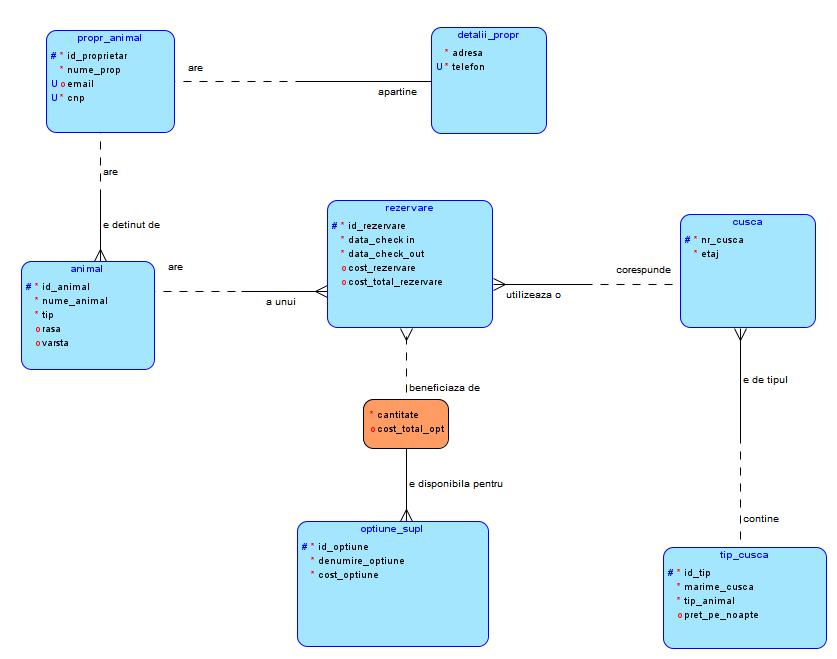
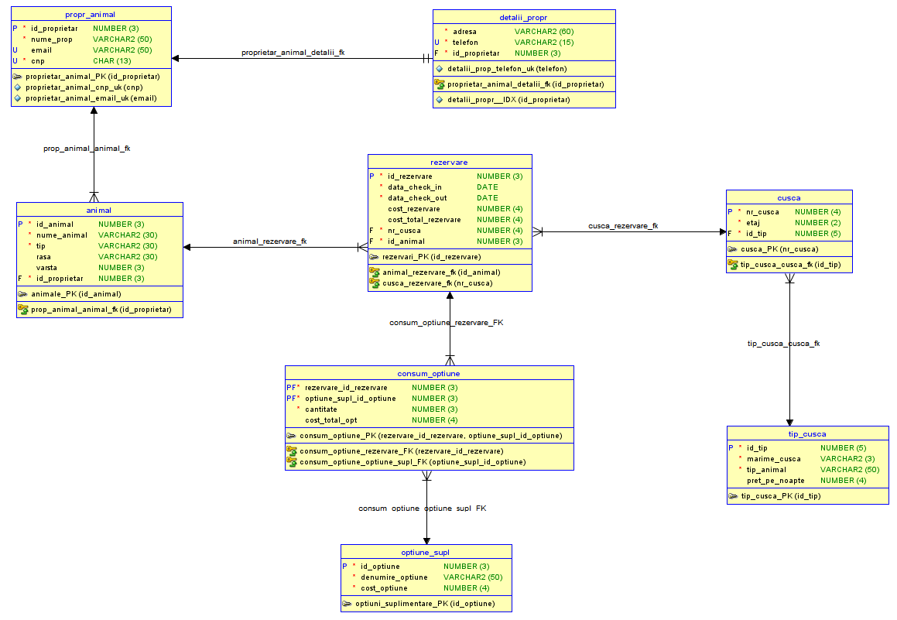

# Pensiunea pentru animale

## Descriere

**Pensiunea pentru animale** este o aplicație de gestionare a rezervărilor și serviciilor pentru câini și pisici, destinată să faciliteze administrarea activităților dintr-o pensiune de animale. Aplicația stochează informații detaliate despre animale, proprietari, rezervări și opțiuni suplimentare de îngrijire. Scopul principal al proiectului este de a asigura o gestionare eficientă și clară a rezervărilor pentru cuști și a serviciilor suplimentare, optimizând procesul de cazare și îngrijire a animalelor.

Pensiunea are o structură pe două etaje, unde câinii și pisicile sunt cazați în cuști individuale. De asemenea, aplicația permite gestionarea informațiilor despre proprietarii animalelor, precum și urmărirea serviciilor adiționale, cum ar fi hrana specială, băile, plimbările și îngrijirea medicală. La finalul șederii, sistemul calculează automat costurile totale ale serviciilor prestate, incluzând cazarea și serviciile adiționale.

Proiectul utilizează o bază de date relațională pentru a organiza datele într-o structură coerentă, facilitând accesul rapid la informațiile necesare și garantând integritatea datelor.

## Diagrama Logică și Diagrama Relațională

### Diagrama Logică

### Diagrama Relațională

## Relațiile dintre tabele

1. **Proprietar Animal - Detalii Proprietar**: Relație de 1 la 1 (One-to-One). Fiecare proprietar are un singur set de detalii (adresă, telefon).
2. **Proprietar Animal - Animal**: Relație de 1 la N (One-to-Many). Un proprietar poate avea mai multe animale, dar fiecare animal aparține unui singur proprietar.
3. **Animal - Rezervare**: Relație de 1 la N (One-to-Many). Fiecare animal poate avea mai multe rezervări în diferite perioade, dar o rezervare aparține unui singur animal.
4. **Rezervare - Cușcă**: Relație de 1 la N (One-to-Many). Fiecare cușcă poate fi asociată cu mai multe rezervări în momente diferite.
5. **Tip Cușcă - Cușcă**: Relație de 1 la N (One-to-Many). Un tip de cușcă (S, M, L) poate fi asociat cu mai multe cuști.
6. **Rezervare - Opțiuni Suplimentare**: Relație de M la N (Many-to-Many). O rezervare poate include mai multe opțiuni suplimentare (baie, îngrijire medicală etc.), iar o opțiune suplimentară poate fi asociată cu mai multe rezervări.
   - **Rezervare - Consum Opțiune**: Relație de 1 la N (One-to-Many). O rezervare poate avea asociate mai multe opțiuni suplimentare consumate.
   - **Optiuni Suplimentare - Consum Opțiune**: Relație de 1 la N (One-to-Many). Fiecare opțiune suplimentară (ex. baie, îngrijire medicală) poate fi asociată cu mai multe înregistrări în Consum Opțiune.
